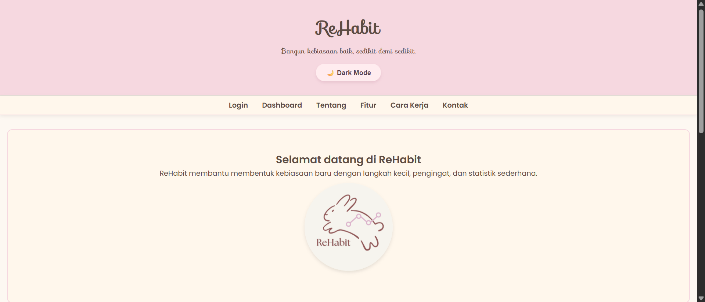
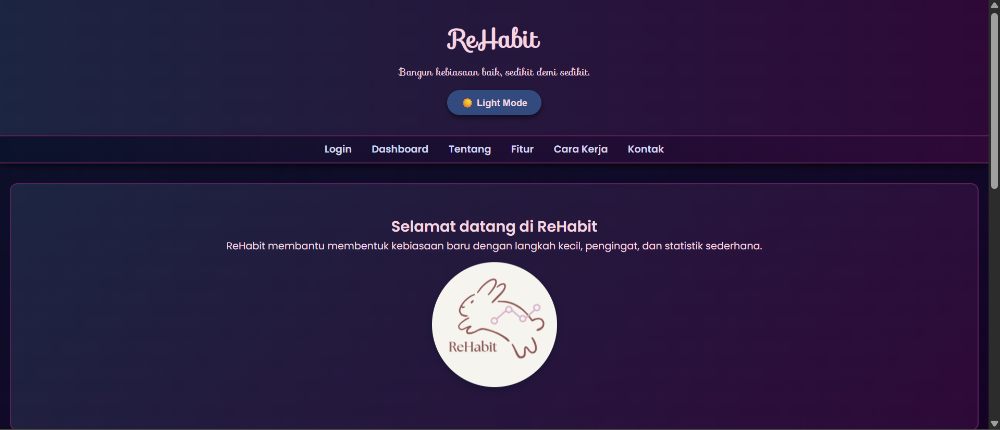
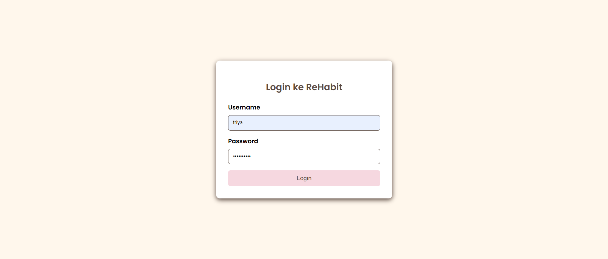
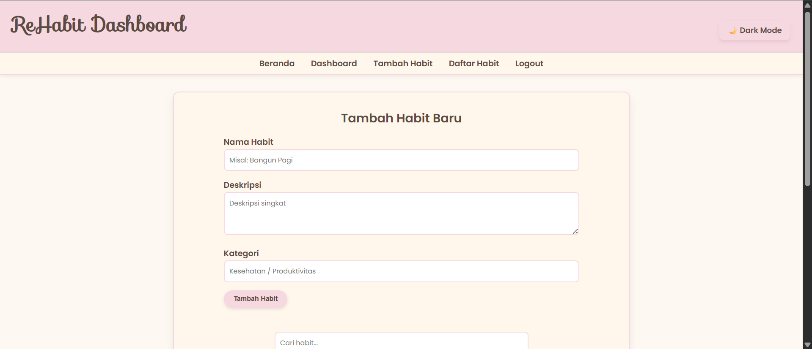
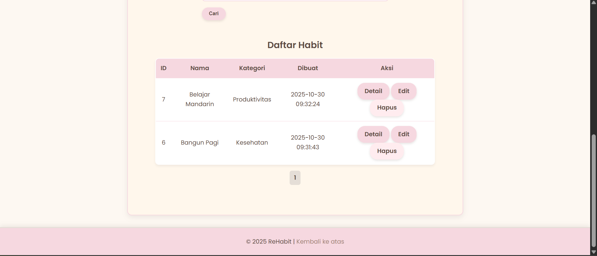
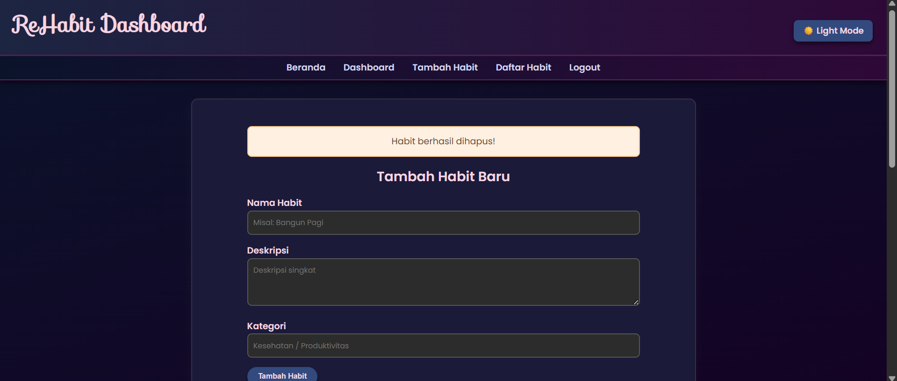

# 🌱 ReHabit – Aplikasi Pelacak Kebiasaan Harian

**ReHabit** adalah aplikasi berbasis web sederhana untuk membantu pengguna membangun dan mempertahankan kebiasaan baik setiap hari.  
Dibuat menggunakan **PHP** dan **MySQL** dengan konsep **CRUD (Create, Read, Update, Delete)**.

---

## ✨ Fitur yang Tersedia

- 🔐 **Autentikasi Pengguna**
  - Login & logout dengan sesi aman.

- 🧠 **Manajemen Kebiasaan (CRUD)**
  - Tambah kebiasaan baru.
  - Edit dan update kebiasaan yang ada.
  - Hapus kebiasaan dengan konfirmasi.
  - Lihat daftar kebiasaan dalam tabel urut berdasarkan waktu dibuat.

- 🔍 **Pencarian dan Pagination**
  - Pencarian kebiasaan berdasarkan nama atau deskripsi.
  - Pagination otomatis (5 data per halaman).

- 💡 **Validasi dan Sanitasi**
  - Validasi sisi server untuk mencegah input kosong.
  - Proteksi dari SQL Injection dan XSS.

- 🌙 **Mode Gelap (Dark Mode)**
  - Tersedia toggle untuk beralih antara mode terang dan gelap.

- 📱 **Desain Responsif**
  - Tampilan modern dan ramah di perangkat.

---

## 🚀 Cara Instalasi dan Konfigurasi

1. **Clone atau Download Project**
   ```bash
   git clone https://github.com/3yakhansa/Habit-Tracker.git
   ```
   atau cukup ekstrak file ZIP ke dalam folder `C:\laragon\www\Habit-Tracker`.

2. **Buat Database**
   Buka **phpMyAdmin** dan jalankan SQL berikut:
   ```sql
   CREATE DATABASE habit_tracker CHARACTER SET utf8mb4 COLLATE utf8mb4_unicode_ci;
   USE habit_tracker;

   CREATE TABLE habits (
       id INT AUTO_INCREMENT PRIMARY KEY,
       name VARCHAR(255) NOT NULL,
       description TEXT,
       created_at DATETIME DEFAULT CURRENT_TIMESTAMP,
       updated_at DATETIME DEFAULT CURRENT_TIMESTAMP ON UPDATE CURRENT_TIMESTAMP
   );
   ```

3. **Konfigurasi Database**
   Buka file `database.php` dan sesuaikan kredensial:
   ```php
   $db_host = 'localhost';
   $db_name = 'habit_tracker';
   $db_user = 'root';
   $db_pass = '';
   ```

4. **Jalankan di Browser**
   ```
   http://localhost/Habit-Tracker/
   ```

5. **Login**
   - Gunakan username = 'triya' dan password = '2409106038'.

---

## 🗂️ Struktur Folder

```
rehabit/
├── assets/
│   ├── style.css                   # File CSS utama (termasuk dark mode)
│   ├── script.js                   # Logika dark mode toggle
│   └── rehabit.png                 # Gambar logo
│   ├── dashboard.png               # screenshot dashboard
│   └── dashboard-2.png             # screenshot dashboard 2
│   └── dashboard-dark.png          # screenshot dashboard dark mode
│   └── login.png                   # screenshot login
│   └── screemshot-landing-dark.png #  screenshot landing page dark mode
│   └── screemshot-landing.png      #  screenshot landing page 
│
├── database.php           # Koneksi dan setup database
├── index.php              # Halaman utama landing page
├── login.php              # Halaman login
├── dashboard.php          # CRUD kebiasaan pengguna
├── edit.php               # Halaman edit habit
├── delete.php             # Proses hapus habit
├── logout.php             # Logout user
└── README.md              # Dokumentasi proyek
```

---

## 🔧 Contoh Environment Config

```env
DB_HOST=localhost
DB_NAME=habit_tracker
DB_USER=root
DB_PASS=
APP_ENV=local
APP_DEBUG=false
```

```

## 🖼️ Screenshot Aplikasi

### 1. Halaman Utama (Landing Page)




### 2. Login


### 3. Dashboard CRUD Habits





---

## 🧑‍💻 Pengembang

**Nama:** Triya  
**Email:** 3yanisa@gmail.com  
**Tahun:** 2025  
**Mata Kuliah:** Pemrograman Web Praktikum  

---

## 🪪 Lisensi

Aplikasi ini dibuat untuk tujuan pembelajaran.  

---

> _"Bangun kebiasaan kecil hari ini, untuk perubahan besar esok hari."_ 🌱
